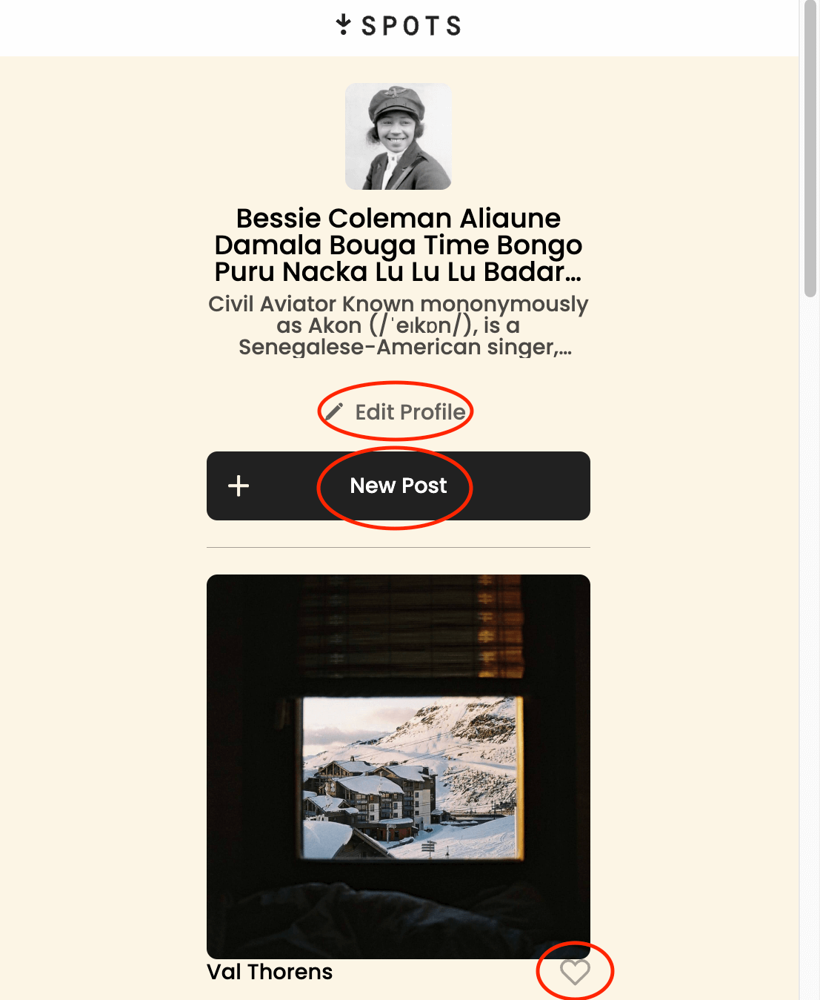

# Project 3: Spots

An image sharing site.

### Overview

- Intro
- Figma
- Images

**Intro**

This project is made so all the elements are displayed correctly on popular screen sizes. We recommend investing more time in completing this project, since it's more difficult than previous ones.

## Description of spots

- Spots is an interactive social media app that lets users share content and engage with others.

## Functionality of spots

- Users can add photos, like photos, and make a few minor adjustments to their profile.

## Tech stack

- HTML
- CSS
- Responsive Design

## Technologies and techniques used on the webpage

- Users can interact with the red-circled elements on the page, such as editing their profile, creating a new post, and liking a post.

## Technologies and techniques used on the mobile

- The same can be done on a mobile device.

## Deployment

- This webpage is deployed to GitHub Pages.

- [Link to the project on Figma](https://ttkhalid.github.io/se_project_spots/)
